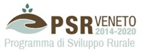

Introduzione
==================

Scopo del Tutorial
------------------------------------------

Il presente tutorial (in Italiano) ha lo scopo di guidare l'utente base nella gestione di dati lidar con QGIS a fini forestali. 
Dopo una breve sezione introduttiva sulla tecnologia LIDAR e le sue principali applicazioni in ambito ambientale e non solo, si focalizzerà sul nuovo plugin realizzato per semplificare le procedure di calcolo del CHM a partire dai dati di DSM e DTM.

In conclusione si proveranno a capire come analizzare i risulati e procedere ad una loro riclassificazione e successiva vettorializzazione.

Glossario
------------------------------------------

* CHM: Canopy Height Model
* DSM: Digital Surface Model
* DTM: Digital Terrain Model
* GIS: Geographic Information System
* LIDAR: Laser Imaging Detection and Ranging

Credits
------------------------------------------
Il tutorial è stato realizzato da `Gter srl`_  e distribuito con licenza https://creativecommons.org/licenses/by/4.0/

Iniziativa finanziata dal Programma di sviluppo rurale per il Veneto 2014-2020 
Organismo responsabile dell’informazione: GTER Innovazione in Geomatica, GNSS e GIS
Autorità di gestione: Regione del Veneto - Direzione AdG FEASR e Foreste 

http://www.avepa.it/

http://www.piave.veneto.it/web/guest

http://www.venetoagricoltura.org/

https://psrveneto.it/

.. _Gter srl: https://www.gter.it
