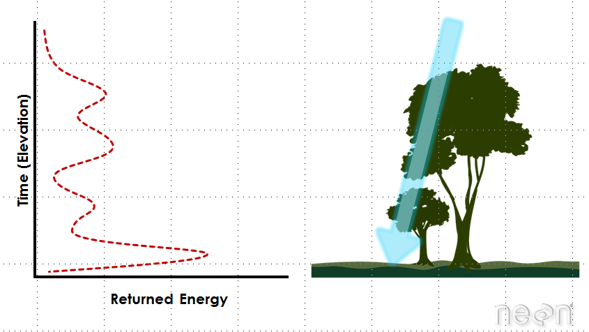

Cos'è la tecnologia LIDAR
===========================

Definizione
-------------------------------------------------------

Il LIDAR è una tecnologia attiva di *remote sensing* che consente di che permette di determinare la distanza di un oggetto o di una superficie utilizzando un impulso laser. 
E' definita una tecnologia *attiva* in quanto, a differenza di altre tecnologie di telerilevamento passive che sfruttano l'energia emessa dal sole (es. sensori ottici) emette una certa energia, sotto forma di un raggio laser, per rtilevare la forma di oggetti. Nella fattispecie il lidar a differenza di tencologie simili quale il radar o il sonar usa poca energia (da qui il termine *light* enettendo un laser con lunghezze d'onda ultraviolette, nel visibile o nel vicino infrarosso.

In rete si può trovare molto materiale sulla tecnologia LIDAR su sul sisto 'neon science_' (NEON: National Ecological Observatory Network). A titolo di esempio questo questo video vale molto più di mille parole per comprendere cosa sia il lidar, come funzioni e quali sono le principali applicazioni:

.. raw:: html

    

        <iframe src="https://youtu.be/m7SXoFv6Sdc?cc_load_policy=1&cc_lang_pref=en" frameborder="0" allow="accelerometer; autoplay; encrypted-media; gyroscope; picture-in-picture" allowfullscreen style="position: absolute; top: 0; left: 0; width: 100%; height: 100%;"></iframe>
    

    
"""""""""""""""""""""""""""""""""""""""""""""""

Come funziona il lidar?
-----------------------------------------------------
Di fatto il lidar misura il tempo con cui un'onda emessa ritorna alla sorgente dopo essere stata riflessa e, sulla base di questo tempo è in grado di misurare la distanza.

.. image:: img/LIDAR-scanned-SICK-LMS-animation.gif

Fonte: Mike1024_ via Wikimedia Commons

.. _Mike1024: https://commons.wikimedia.org/wiki/File:LIDAR-scanned-SICK-LMS-animation.gif

Grazie all'uso combinato con GPS e IMU è in grado di convertire una misura della distanza con la quota di un oggetto sul terreno.

In realtà  l'impulso emesso dal laser genera più di una risposta nel tempo, meglio definita con il termine inglese *pulse* o impulso. Graficando il tempo impiegato da ciascun fascio emesso per tornare al sensore e l'energia si possono individuare diversi picchi (definiti appunto *pulse*) che permettono di individuare al meglio la forma degli oggetti presenti sul terreno.

Un esempio di risposta letta dal sensore lidar è mostrata nella seguente figura:

Source: NEON, Boulder, CO.

Usando quindi i dati LIDAR grezzi si possono ricavare diversi indici e classificare accuratamente il terreno. A titolo di esempio ecco alcuni indici: 

* Canopy Height
* Canopy Cover
* Leaf Area Index
* Vertical Forest Structure

Si può addirittura arrivare all'identificazione delle singole specie, anche se solo in foreste poco dense e disponendo di un'alta densità di punti

.. _neon science: https://www.neonscience.org/

Dal processamento dei dati LIDAR ai GIS: applicazioni
-------------------------------------------------------

Spesso però i dati LIDAR vengono restituiti sulla base di prodotti topografici comunemente noti come:

* il DTM ottenuto dall'ultimo impulso 
* il DSM ottenuto invece con il primo impulso ricevuto (DSMFirst) e in taluni casi quello ottenuto con l'ultimo impulso.

Sono questi prodotti facilmente consultabili con qualunque software GIS. 

A titolo di esempio ecco una tile del DSM (DSMFirst) di Regione Veneto nei pressi di Cortina d'Ampezzo:

Ed l'analoga tile con il DTM:

Calcolo del CHM
-------------------------------------------------------

A partire da dati raster GIS come il DTM e il DSM può essere nuovamente ricavato il CHM come risultato 
della sottrazione fra DSM e DTM.

.. image:: img/lidarTree-height.png

Note sul calcolo del CHM
-------------------------------------------------------
Il CHM così calcolato ovviamente include tutti gli elementi presenti sul terreno incluso ovviamente l'edificato. 

A tal proposito in alcuni casi viene fornito sia il DSMFirst che il DSMLast le cui differenze sono pressochè nulle in corrispondenza dell'edificato,
più consistenti in corrispondenza di vegetazione.

A titolo di esempio si riportano 2 diversi profili realizzati confrontando DSMFirst, DSMLast e DTM per una tile sul centro di Vicenza (Regione Veneto)

* il primo caso è stato realizzato in centro, nei pressi del palazzo comunale e della famosa basilica Palladiana (Link OpenStreetMap: https://osm.org/go/0IBaN62IU--?m=)

.. image:: img/cfr_edifici.png

* il secondo caso è stato realizzato nei pressi della stazione confrontando un area a parco urbano con gli edifici della stazione ferroviaria (Link OpenStreetMap:https://osm.org/go/0IBaM4VaZ--?m=)

.. image:: img/cfr_alberi_stazione.png

Si può notare come:

* la differenza tra DSM e DTM includa ovviamente sia l'edificato che la vegetazione e quindi vada usata con cautela per applicazioni forestali
* la disponibilità di altri prodotti (es. DSMLast e DSMFirst) possa in qualche modo aiutare l'utente ell'analisi e classificazione dei prodotti ottenuti

