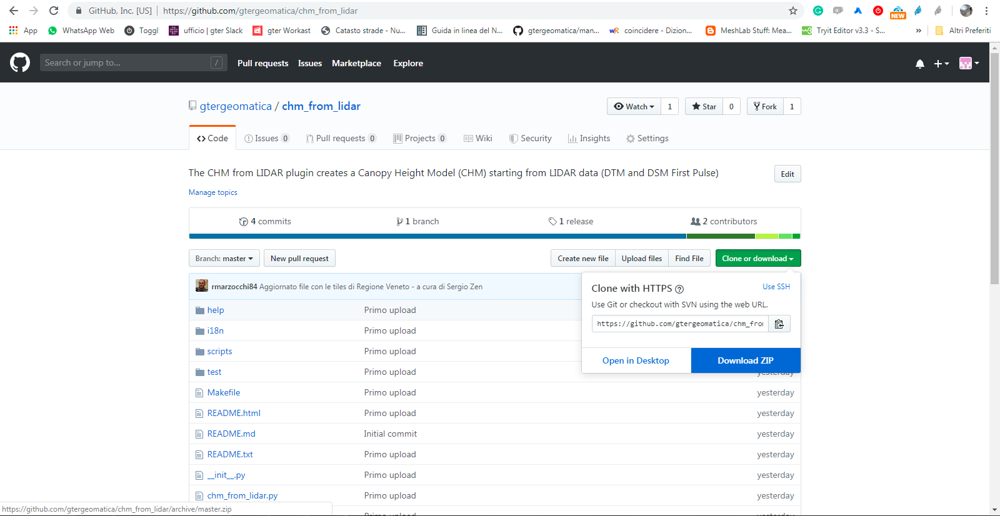
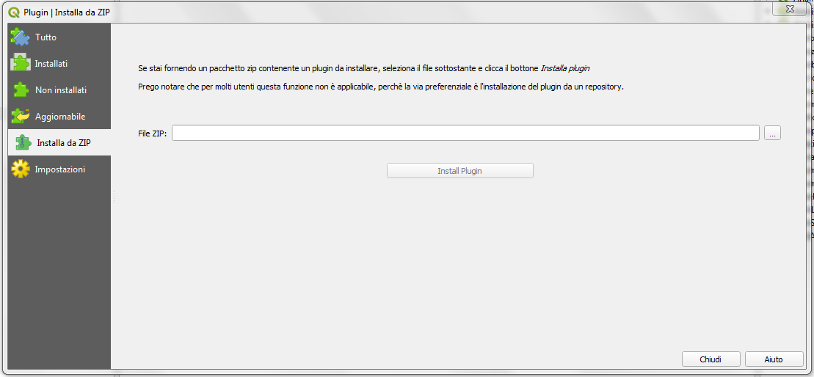
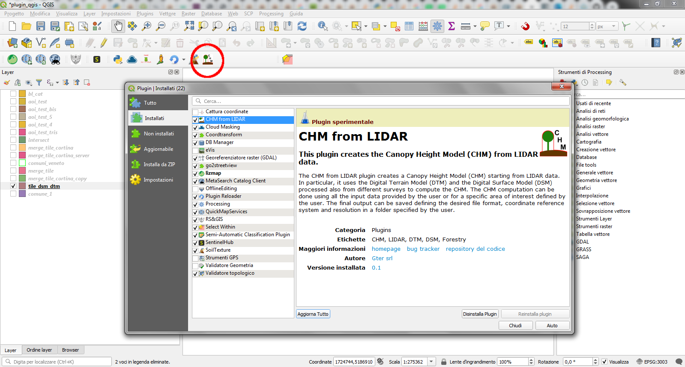

Il plugin CHM from LIDAR
==================================
Il Plugin CHM from LIDAR consente la generazione del Canopy Height Model (CHM) a partire da dati Lidar, in particolare DTM e DSM (First Impulse).

I principali input del plugin sono i file DSM e DTM derivanti dalle diverse campagne di volo, dai quali verrà calcolato il CHM, e un file vettoriale (formato GeoPackage) contenente le geometrie degli squadri (tile) che compongono le diverse campagne di rilievo. In particolare quest ultimo viene automaticamente caricato all'interno del progetto QGIS all'avvio del plugin. Qualora invece fosse stato già caricato durante una sessione di lavoro precedente non sarà nuovamente caricato ma verrà semplicemente reso attivo quello già presente.
Il file vettoriale delle tile, nominato *tile_dsm_dtm*, contiene nella tabella alfanumerica associata tutte le informazioni necessarie al reperimento dei relativi file DSM e DTM per il calcolo del CHM (percorso ai file, nome del file, nome della campagna, sistema di riferimento, ecc.). Il plugin quindi, sulla base dei parametri di input richiesti dall'utente, sarà in grado di recuperare automaticamente i DSM e DTM delle tile selezionate leggendo tutte le informazioni necessarie (percorso + nome file) dalla tabella associata al file tile_dsm_dtm.

NB: non rinominare il layer *tile_dsm_dtm* all'interno del progetto QGIS, il plugin infatti lo richiama automaticamente ogni volta che viene attivato. Qualora si modificasse il nome del layer nel progetto, il plugin non lo riconoscerebbe più e lo ricaricherebbe all'interno del progetto stesso.

Il calcolo del CHM verrà automaticamente processato per tutte le tile selezionate secondo i parametri richiesti dall'utente. E' infatti possibile calcolare il CHM di ogni tile appartenente a una specifica campagna di volo, oppure per tutte le tile che intersecano un Area di Interesse (di seguito AOI) definita dall'utente.

Nel primo caso il CHM di ogni singola tile appartenente alla campagna selezionata sarà calcolato con formato e sistema di riferimento definiti dall'utente e salvato nella cartella di output anch'essa definita dall'utente. Nel secondo caso sarà calcolato il CHM di ogni singola tile che interseca l'AOI specificata e verranno salvati nella cartella di output definita dall'utente con formato e sistema di riferimento richiesto, inoltre verrà anche creato un file raster contenente il ritaglio (clip) dei CHM calcolati sulla boundary dell'AOI specificata. Anche il clip verrà salvato nella cartella di output definita dall'utente con nome, formato e sistema di riferimento desiderati.

Di seguito verranno meglio dettagliati tutte le possibili casistiche, i parametri definibili dall'utente e in generale il workflow del plugin CHM from LIDAR.

Connessione WCS/WMS al portale cartografico
--------------------------------------------

L'Infrastruttura Dati Regionali (IDT) di Regione Veneto è ormai arrivata alla sua versione 2.0 e accessibile all'inirizzo https://idt2.regione.veneto.it/

Da li si possono caricare e visualizzare i seguenti servizi:

- servizi OWS (Web Mapping Services, Web Feature Services e volendo Web Coverage Services[1]_) presenti su geoserver regionale: https://idt2-geoserver.regione.veneto.it/geoserver/ows (prevalentemente dati vettoriali o altri dati anche raster che non utilizzano cache)

- servizi WMTS: https://idt2.regione.veneto.it/gwc/service/wmts (Layer raster o che utilizzano la cache es. ortofoto)

- catalogo metadati: https://idt2.regione.veneto.it/geoportal/csw 

.. [1] per ora i geoservizi WCS non sono disponibili

Connessione ai dati regionali 
--------------------------------------------
Di default nel file *tile_dsm_dtm* sono inclusi i percorsi alle cartelle dell'infrastruttura di rete regionale (Regione Veneto). E possibile modificarli e personalizzarli con i propri percorsi (se necessario). 

Responsabile dei dati è il dott. Sergio Zen - sergio.zen@regione.veneto.it
 

 

Repository github e installazione del plugin
--------------------------------------------
Attualmente il plugin CHM from LIDAR è in attesa di approvazione da parte del Team di QGIS, pertanto non è ancora disponibile dalla repository ufficiale di QGIS.

Il plugin CHM from LIDAR è comunque disponibile alla repository github https://github.com/gtergeomatica/chm_from_lidar e può essere scaricato come file .zip e facilmente installato in QGIS seguendo i passi elencati sotto:

* da un qualsiasi browser web andare all'indirizzo https://github.com/gtergeomatica/chm_from_lidar
* Clickare su **Clone or Download** e successivamente su **Download ZIP** e salvare il file zip in una cartella sul proprio PC

* Da QGIS menù Plugins --> Gestisci e installa Plugin --> Installa da ZIP

Da qui è necessario selezionare tramite il pulsante di navigazione il file ZIP scaricato precedentemente e infine clickare su *Installa Plugin*. Una volta terminata l'installazione il plugin CHM from LIDAR sarà visibile nell'elenco dei plugin installati e l'icona del plugin sarà stata aggiunta automaticamente alla barra degli strumenti.

Una volta che il plugin CHM from LIDAR sarà approvato dal Team di QGIS sarà invece possibile installarlo con la procedura standard per l'installazione dei Plugin di QGIS da menù Plugins --> Gestisci e installa Plugin --> Non Installati

Caratteristiche e funzionamento
--------------------------------------------
Come già anticipato, lo scopo principale del plugin CHM from LIDAR è calcolare il CHM a partire dai dati Lidar (DSM e DTM) ottenuti dalle varie campagne di rilievo che si sono tenuto sul territorio. Il workflow generale del Plugin è composto da:

* Selezione delle tile dal layer vettoriale tile_dsm_dtm (che viene caricato e/o attivato automaticamente nel progetto QGIS all'avvio del plugin) che contiene appunto le tile di tutte le campagne effettuate sul territorio della regione Veneto. Le tile vengono selezionate sulla base dei parametri definiti in input dall'utente. Ad esempio scegliendo la sola campagna di volo verranno selezionate tutte le tile appartenenti a quella campagna, scegliendo una campagna e un'AOI verranno selezionate tutte le tile della campagna richiesta che intersecano l'area di interesse fornita in input. Nel caso in cui venga invece fornita dall'utente la sola AOI verranno selezionate tutte le tile che intersecano l'AOI a prescindere dalla campagna di volo a cui appartengono. In questo caso si potranno verificare diverse situazioni: tutte le tile selezionate appartengono a una sola campagna, le tile selezionate appartengono a campagne diverse ma non c'è sovrapposizione (tile adiacenti), le tile selezionate appartengono a campagne diverse e c'è sovrapposizione (es. campagne svolte in periodi diversi sulla stessa zona). Le tile selezionate verranno salvate su un nuovo layer vettoriale che, a seconda che si tratti di una selezione per sola campagna o per AOI, verrà nominato con il nome della campagna o del file clip oltre che alla data di creazione che permetterà di tenere traccia dei CHM calcolati in precedenza e delle aree di interesse che sono state scelte. Tutte le informazioni relative ai nuovi CHM creati (percorso di salvataggio, nome del file, formato e sistema di riferimento) saranno automaticamente aggiunte nella tabella del layer vettoriale generato dalla selezione delle tile.

* Calcolo del CHM per le tile selezionate. Il CHM viene calcolato per ogni singola tile selezionata. I file vengono salvati nella cartella di output definita dall'utente con formato e sistema di riferimento forniti dall'utente tramite il settaggio dei parametri di input dall'interfaccia grafica. In caso la selezione avvenga tramite un'AOI verrà anche generato un file con il ritaglio dei CHM generati sul confine dell'AOI selezionata.

* I risultati finali ovvero i CHM e il clip vengono automaticamente caricati all'interno del progetto QGIS.

Tutti i parametri di input necessari al calcolo del CHM sono settati dall'utente tramite l'interfaccia grafica del plugin che viene visualizzata clickando sull'icona presente nella toolbar una volta avvenuta l'installazione.

.. image:: img/gui.png

* **1 - Select an AOI:** da qui è possibile selezionare il layer vettoriale contenente le geometrie dell'are di interesse per la quale si desidera calcolare il CHM. Il menù a tendina elenca tutti i layer vettoriali caricati all'interno del progetto corrente, è quindi necessario che il vettoriale contenete l'AOI sia stato già caricato nel progetto Qgis.
* **2 - Using selected features:** qualora il layer dell'AOI selezionato avesse geometrie selezionate la check box si attiva. Checkandola verranno quindi utilizzate le sole geometrie selezionate e quindi verranno selezionate tutte le tile (dal layer tile_dsm_dtm) che intersecano le sole geometrie selezionate nel layer di AOI selezionato al punto 1. Se la check box non viene spuntata verrà utilizzato per l'intersezione l'intero layer. Nel caso in cui nel layer di AOI selezionato non siano presenti geometrie selezionate la check box sarà disattivata.
* **3 - Select di autority:** tra le varie informazioni immagazzinate nella tabella del layer delle tile (tile_dsm_dtm) è presente anche l'Ente che ha gestito la campagna di volo. Il menù a tendina elenca tutti gli enti indicati all'interno della tabella, è possibile quindi selezionare l'ente desiderato e di conseguenza visualizzare nel menù a tendina, di cui al punto 4, le sole campagne di volo gestite dall'ente selezionato. NB: in questo momento questa funzione non è ancora attiva, verrà integrata nel codice nei giorni seguenti al corso.
* **4 - Select a campaign:** sulla base dell'ente selezionato al punto 3, il menù a tendina elencherà tutte le campagne di volo gestite dall'ente. Sarà quindi possibile selezionare la campagna desiderata per la quale calcolare il CHM. NB: al momento il menù a tendina elenca tutte le campagne presenti nella tabella degli attributi associata al layer delle tile  (tile_dsm_dtm) senza il filtro sulla base dell'ente. Questa funzione sarà implementata nei prossimi giorni come già detto al punto 3.
* **5 - Clip file name:** selezionando un'are di interesse è necessario indicare un nome per il raster che conterrà il CHM ritagliato sul confine dell'area AOI selezionata. E' necessario indicare solo il nome senza l'estensione del file che verrà aggiunta automaticamente sulla base del formato di output scelto dall'utente. Qualora l'utente non indicasse il nome per il clip, il plugin restituirà un warning in cui si avvisa l'utente che verrà dato al file un nome di default (es. clip.*). **NB: non inserire nel nome del file spazi o caratteri speciali.**
* **6 - Choose resolution (m):** da qui è possibile selezionare la risoluzione, espressa in metri, con cui verrà ricampionato il file del clip. I CHM delle singole tile vengono infatti calcolati con la risoluzione originaria del DSM e DTM, mentre per quanto riguarda il clip è possibile appunto definire una risoluzione diversa da quella originaria. Il valore è espresso in metri. Qualora si volesse utilizzare un sistema di riferimento non proiettato (es. WGS84 con unità in gradi), la risoluzione deve essere comunque espressa in metri, sarà il plugin a convertire il valore fornito nell'unità di misura corrispondente al sistema di riferimento scelto. Qualora l'utente non specifichi un valore lasciando la box al valore di default (0.00), verrà utilizzata la risoluzione originaraia del DSM e del DTM per calcolare il clip. La box per la scelta della risoluzione si attiverà solo nel caso in cui venga selezionata la sola AOI, senza quindi selezionare una campagna specifica. Infatti qualora venga selezionata anche una campagna di volo la box sarà disattivata e il clip verrà restituito con la stessa risoluzione del CHM, ovvero quella originaria. NB: qualora l'utente definisse un valore di risoluzione inferiore a quello del dato di origine, il plugin restituirà un warning.
* **7 - Output CHM folder:** premendo sul bottone (...) si aprirà una finestra di dialogo tipo esplora risorse da cui sarà possibile navigare all'interno della propria macchina e selezionare la cartella dentro cui si desiderano salvare tutti gli output del processo (CHM delle singole tile e clip). Una volta selezionata la cartella il percorso a questa comparirà nella stringa di testo accanto al bottone. NB: qualora l'utente non selezionasse una cartella di output il plugin restituirà un messaggio di errore, il processo verrà bloccato e l'utente avrà la possibilità di selezionare la cartella e successivamente rilanciare il calcolo.
* **8 - scelta del formato:** dal menù a tendina è possibile selezionare il formato di output con cui si vogliono salvare i risultati del processo, sia i CHM delle singole tile che il clip file. Di default il formato selezionato è il GeoTIFF.
* **9 - scelta del sistema di riferimento:** clickando sul bottone si aprirà la finestra di dialogo standard di Qgis per la scelta del sistema di riferimento. Di default il plugin utilizza il sistema di riferimento originario del DSM e DTM. Qualora invece l'utente selezionasse un sistema di riferimento diverso, gli output del processamento saranno riproiettati nel sistema di riferimento richiesto.
* **10 - remove values < 0:** la casella di controllo permette appunto di gestire l'eliminazione di eventuali valori negativi dal CHM. Se la casella è spuntata i valori negativi presenti nei CHM calcolati verranno posti uguali a 0. Di default la casella è già spuntata ma è sufficiente rimuovere la spunta per ottenere i CHM risultanti con il valore minimo effettivo quindi eventualmente comprensivo anche di valori negativi.
* **11- remove values > xx:** in questo caso inserendo un valore numerico intero nella box verranno eliminati dai CHM finali i valori maggiori del valore di soglia indicato. Come nel caso della soglia per i valori negativi, anche in questo caso tutti i pixel con valore maggiore di quello indicato verranno posti uguali al valore stesso. Di default il valore è 0, qualora l'utente non specifichi un valore di soglia diverso da quello di default, verrà restituito il CHM con i valori effettivi.
* **12 - Log:** in questa area compariranno durante il processo messaggi informativi sullo stato di avanzamento del processo. Qui appariranno anche eventuali messaggi di warning e di errore. Nel caso di warning si tratta solo di avvisi per l'utente che però non bloccano il processo, in caso di errori o problematiche di vario tipo verrà restituito un messaggio e l'utente potrà modificare l'impostazione dei parametri di input e successivamente rilanciare il processamento. Al termine del processo, qualora andato a buon fine, comparirà un messaggio contenente un riassunto di tutti i parametri di input indicati per il calcolo seguito dalla scritta 'Processo terminato'.
* **13 - Clear Log:** si tratta di un bottone che pulisce l'area di testo eliminando i messaggi relativi a un processamento precedente.
* **14 - OK:** è il pulsante che l'ancia l'intero processamento. Una volta definiti tutti i parametri in input l'utente clickando sul pulsante Ok darà avvio al processo vero e proprio. Come già anticipato al punto 12, in caso di messaggi di errore che richiedano da parte dell'utente un'ulteriore interazione con l'interfaccia grafica, sarà possibile andare a modificare i parametri necessari e successivamente clickare nuovamente il tasto ok per rilanciare il processamento.
* **15 - Close:** l'interfaccia grafica del plugin resta aperta e attiva finchè l'utente non la chiuderà clickando sul tasto Close. In questo modo si chiuderà l'interfaccia grafica e tutti i vari parametri di input verranno ripristinati ai loro valori di default.

Prove di elaborazione
--------------------------------------------

In occasione del corso è stato preparato un dataset ridotto che verrà utilizzato per mostrare il funzionamento del plugin ed esemplificare le diverse casistiche che si possono presentare. Nella cartella **dataset_corso_06_19_venezia** sono contenuti:
* file tile_regione_cortina.gpkg: estrazione del file *tile_dsm_dtm* per il comune di Cortina d'Ampezzo
* file c0605011_categforestali.shp: estrazione della Carta Forestale Regionale per il comune di Cortina d'Ampezzo
* cartella dati_lidar: contiene le sottocartelle relative ad alcune campagne di volo effettuate sul territorio del comune di Cortina d'Ampezzo, in particolare per il corso sono state selezionate solo alcune campagne e un numero limitato di tile per ridurre i tempi di computazione in aula

