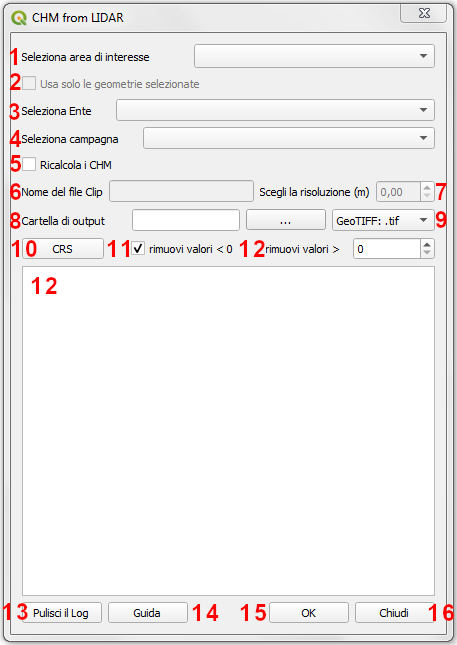

Il plugin CHM from LIDAR
==================================
Il Plugin CHM from LIDAR consente la generazione del Canopy Height Model (CHM) a partire da dati Lidar, in particolare DTM e DSM (First Impulse).

I principali input del plugin sono i file DSM e DTM derivanti dalle diverse campagne di volo, dai quali verrà calcolato il CHM, e un file vettoriale (formato GeoPackage) contenente le geometrie degli squadri (tile) che compongono le diverse campagne di rilievo. In particolare quest ultimo viene automaticamente caricato all'interno del progetto Qgis all'avvio del plugin. Qualora invece fosse stato già caricato durante una sessione di lavoro precedente non sarà nuovamente caricato ma verrà semplicemente reso attivo quello già presente.
Il file vettoriale delle tile, nominato tile_dsm_dtm, contiene nella tabella alfanumerica associata tutte le informazioni necessarie al reperimento dei relativi file DSM e DTM per il calcolo del CHM (percorso ai file, nome del file, nome della campagna, sistema di riferimento, ecc.). Il plugin quindi, sulla base dei parametri di input richiesti dall'utente, sarà in grado di recuperare automaticamente i DSM e DTM delle tile selezionate leggendo tutte le informazioni necessarie (percorso + nome file) dalla tabella associata al file tile_dsm_dtm.

NB: non rinominare il layer tile_dsm_dtm, il plugin infatti lo attiva automaticamente sulla base del nome. Modificando il nome quindi, il plugin non riconoscerà più il file in oggetto e lo ricaricherà all'interno del progetto.

Il calcolo del CHM verrà automaticamente processato per tutte le tile selezionate secondo i parametri richiesti dall'utente. E' infatti possibile calcolare il CHM di ogni tile appartenente a una specifica campagna di volo, oppure per tutte le tile che intersecano un Area di Interesse (di seguito AOI) definita dall'utente.
Nel primo caso il CHM di ogni singola tile appartenente alla campagna selezionata sarà calcolato con formato e sistema di riferimento definiti dall'utente e salvato nella cartella di output anch'essa definita dall'utente. Nel secondo caso sarà calcolato il CHM di ogni singola tile che interseca l'AOI specificata e verranno salvati nella cartella di output definita dall'utente con formato e sistema di riferimento richiesto, inoltre verrà anche creato un file raster contenente il ritaglio (clip) dei CHM calcolati sulla boundary dell'AOI specificata. Anche il clip verrà salvato nella cartella di output definita dall'utente con nome, formato e sistema di riferimento desiderati.

Di seguito verranno meglio dettagliati tutte le possibili casistiche, i parametri definibili dall'utente e in generale il workflow del plugin CHM from LIDAR.

Connessione WCS/WMS al portale cartografico
--------------------------------------------

L'Infrastruttura Dati Regionali (IDT) di Regione Veneto è ormai arrivata alla sua versione 2.0

https://idt2.regione.veneto.it/

Connessione ai dati regionali 
--------------------------------------------

 

Repository github e installazione del plugin
--------------------------------------------

Caratteristiche e funzionamento
--------------------------------------------
Una volta installato il plugin comparirà nella toolbar dei plugin installati l'icon del plugin .. image:: img/icon.png

Clickando sull'icona del plugin viene visualizzata l'interfaccia grafica da cui l'utente può definire i parametri di input necessari al calcolo del CHM.

* **1 - Select an AOI:** da qui è possibile selezionare il layer vettoriale contenente le geometrie dell'are di interesse per la quale si desidera calcolare il CHM. Il menù a tendina elenca tutti i layer vettoriali caricati all'interno del progetto corrente, è quindi necessario che il vettoriale contenete l'AOI sia stato già caricato nel progetto Qgis.
* **2 - Using selected features:** qualora il layer dell'AOI selezionato avesse geometrie selezionate la check box si attiva. Checkandola verranno quindi utilizzate le sole geometrie selezionate e quindi verranno selezionate tutte le tile (dal layer tile_dsm_dtm) che intersecano le sole geometrie selezionate nel layer di AOI selezionato al punto 1. Se la check box non viene spuntata verrà utilizzato per l'intersezione l'intero layer. Nel caso in cui nel layer di AOI selezionato non siano presenti geometrie selezionate la check box sarà disattivata.
* **3 - Select di autority:** tra le varie informazioni immagazzinate nella tabella del layer delle tile (tile_dsm_dtm) è presente anche l'Ente che ha gestito la campagna di volo. Il menù a tendina elenca tutti gli enti indicati all'interno della tabella, è possibile quindi selezionare l'ente desiderato e di conseguenza visualizzare nel menù a tendina, di cui al punto 4, le sole campagne di volo gestite dall'ente selezionato. NB: in questo momento questa funzione non è ancora attiva, verrà integrata nel codice nei giorni seguenti al corso.
* **4 - Select a campaign:** sulla base dell'ente selezionato al punto 3, il menù a tendina elencherà tutte le campagne di volo gestite dall'ente. Sarà quindi possibile selezionare la campagna desiderata per la quale calcolare il CHM.
NB: al momento il menù a tendina elenca tutte le campagne presenti nella tabella degli attributi associata al layer delle tile  (tile_dsm_dtm) senza il filtro sulla base dell'ente. Questa funzione sarà implementata nei prossimi giorni come già detto al punto 3.
* **5 - Clip file name:** selezionando un'are di interesse è necessario indicare un nome per il raster che conterrà il CHM ritagliato sul confine dell'area AOI selezionata. E' necessario indicare solo il nome senza l'estensione del file che verrà aggiunta automaticamente sulla base del formato di output scelto dall'utente. **NB: non inserire nel nome del file spazi o caratteri speciali.**
Qualora l'utente non indicasse il nome per il clip, il plugin restituirà un warning in cui si avvisa l'utente che verrà dato al file un nome di default (es. clip.*).
* **6 - Choose resolution (m):** da qui è possibile selezionare la risoluzione, espressa in metri, con cui verrà ricampionato il file del clip. I CHM delle singole tile vengono infatti calcolati con la risoluzione originaria del DSM e DTM, mentre per quanto riguarda il clip è possibile appunto definire una risoluzione diversa da quella originaria. Il valore è espresso in metri. Qualora si volesse utilizzare un sistema di riferimento non proiettato (es. WGS84 con unità in gradi), la risoluzione deve essere comunque espressa in metri, sarà il plugin a convertire il valore fornito nell'unità di misura corrispondente al sistema di riferimento scelto. Qualora l'utente non specifichi un valore lasciando la box al valore di default (0.00), verrà utilizzata la risoluzione originaraia del DSM e del DTM per calcolare il clip.
La box per la scelta della risoluzione si attiverà solo nel caso in cui venga selezionata la sola AOI, senza quindi selezionare una campagna specifica. Infatti qualora venga selezionata anche una campagna di volo la box sarà disattivata e il clip verrà restituito con la stessa risoluzione del CHM, ovvero quella originaria. NB: qualora l'utente definisse un valore di risoluzione inferiore a quello del dato di origine, il plugin restituirà un warning.
* **7 - Output CHM folder:** premendo sul bottone (...) si aprirà una finestra di dialogo tipo esplora risorse da cui sarà possibile navigare all'interno della propria macchina e selezionare la cartella dentro cui si desiderano salvare tutti gli output del processo (CHM delle singole tile e clip). Una volta selezionata la cartella il percorso a questa comparirà nella stringa di testo accanto al bottone. NB: qualora l'utente non selezionasse una cartella di output il plugin restituirà un messaggio di errore, il processo verrà bloccato e l'utente avrà la possibilità di selezionare la cartella e successivamente rilanciare il calcolo.
* **8 -** scelta del formato: dal menù a tendina è possibile selezionare il formato di output con cui si vogliono salvare i risultati del processo, sia i CHM delle singole tile che il clip file. Di default il formato selezionato è il GeoTIFF.
* **9 -** scelta del sistema di riferimento: clickando sul bottone si aprirà la finestra di dialogo standard di Qgis per la scelta del sistema di riferimento. Di default il plugin utilizza il sistema di riferimento originario del DSM e DTM. Qualora invece l'utente selezionasse un sistema di riferimento diverso, gli output del processamento saranno riproiettati nel sistema di riferimento richiesto.
* **10 - remove values < 0:** la casella di controllo permette appunto di gestire l'eliminazione di eventuali valori negativi dal CHM. Se la casella è spuntata i valori negativi presenti nei CHM calcolati verranno posti uguali a 0. Di default la casella è già spuntata ma è sufficiente rimuovere la spunta per ottenere i CHM risultanti con il valore minimo effettivo quindi eventualmente comprensivo anche di valori negativi.
* **11- remove values > xx:** in questo caso inserendo un valore numerico intero nella box verranno eliminati dai CHM finali i valori maggiori del valore di soglia indicato. Come nel caso della soglia per i valori negativi, anche in questo caso tutti i pixel con valore maggiore di quello indicato verranno posti uguali al valore stesso. Di default il valore è 0, qualora l'utente non specifichi un valore di soglia diverso da quello di default, verrà restituito il CHM con i valori effettivi.

Prove di elaborazione
--------------------------------------------

