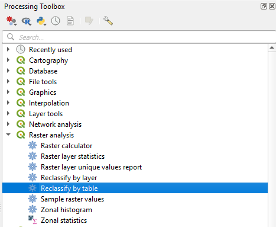
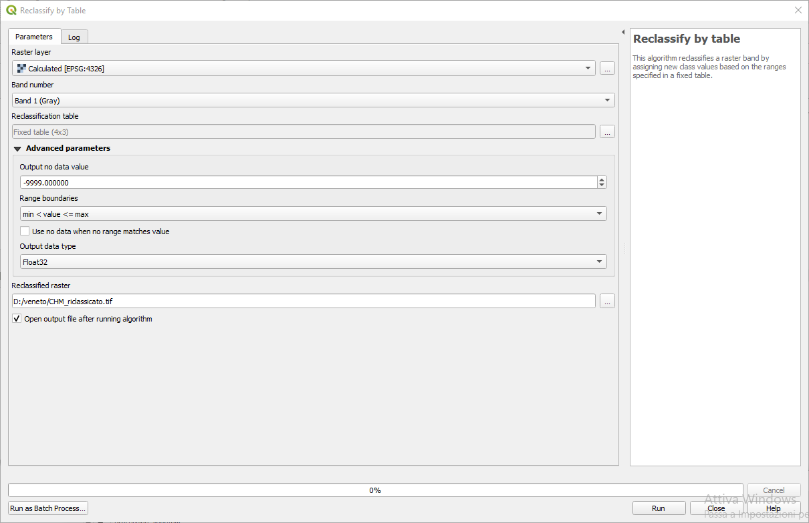
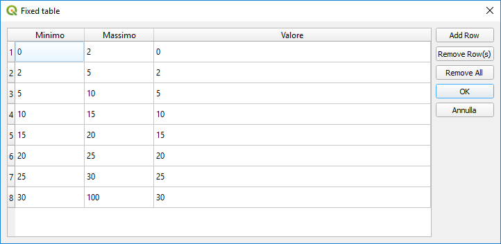
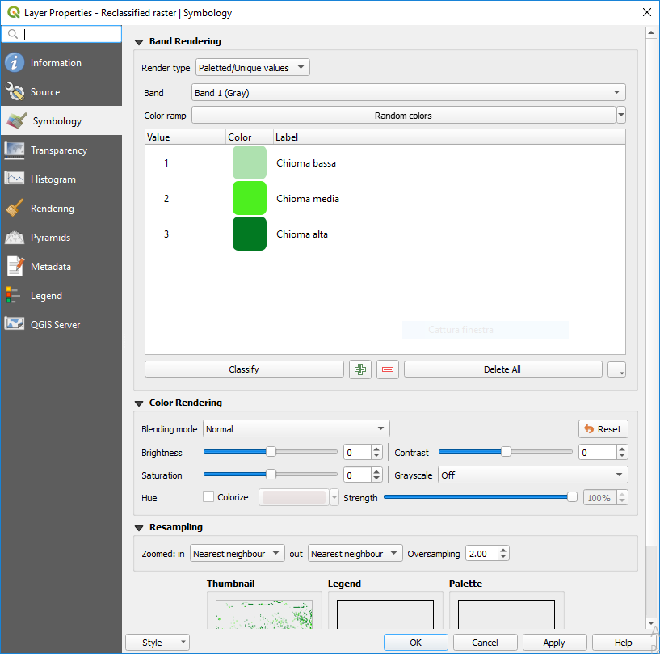
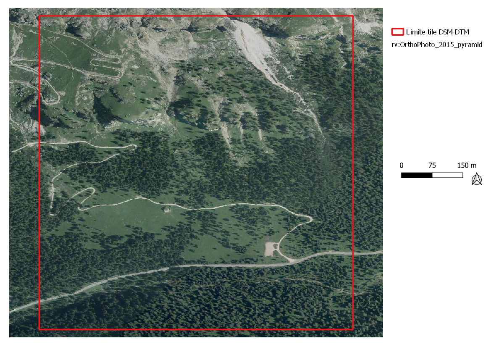
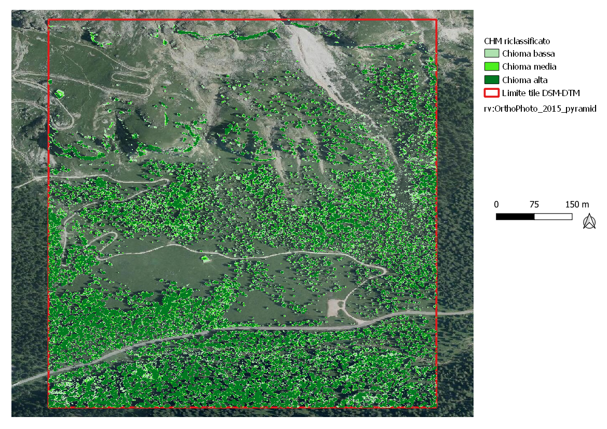

Classificazione dei risultati e vettorializzazione
=======================================================

Una volta ottenuto il CHM... 

Smoothing
-------------------------------------

Riclassificazione
-------------------------------------

* **0-2 metri** : no vegetazione
* **2-5 metri** : chioma bassa
* **5-7 metri** : chioma media
* **>7 metri** : chioma alta

TODO

TODO

TODO

TODO

In immagine si possono visualizzare i risultati della riclassificazione sovrapposti all'ortofoto regionale (2015) 

Eventuale vettorializzazione
-------------------------------------
Si può infine procedere alla vettorializzazione...
